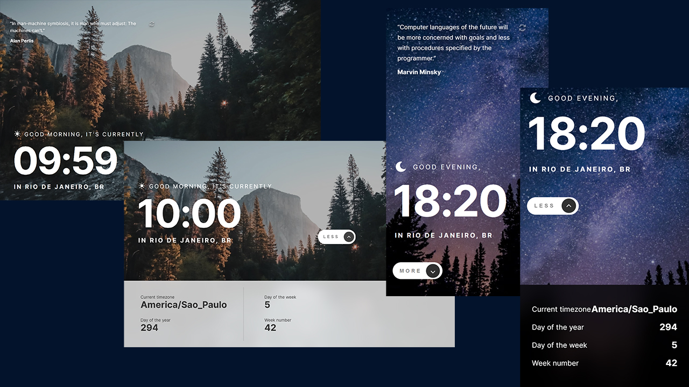

# Clock app



## Welcome! 👋

This is a solution to the [Clock app challenge on Frontend Mentor](https://www.frontendmentor.io/challenges/clock-app-LMFaxFwrM)
This is a project where I built a clock app that changes images according to time and features programming quotes.

## Table of contents

- [Overview](#overview)
  - [The challenge](#the-challenge)
  - [Links](#links)
- [My process](#my-process)
  - [Built with](#built-with)
  - [What I learned](#what-i-learned)
  - [Continued development](#continued-development)
  - [Useful resources](#useful-resources)
- [APIS](#apis)
  - [API - World Time](#world-time)
  - [API - IP Geolocation](#ip-geolocation)
  - [API - Programming Quotes](#programming-quotes)
- [Author](#author)
- [Acknowledgments](#acknowledgments)

## Overview

### :dart: The challenge <a name="the-challenge"></a>

#### Users should be able to:

- View the optimal layout for the site depending on their device's screen size.
- See hover states for all interactive elements on the page.
- View the current time and location information based on their IP address.
- View additional information about the date and time in the expanded state.
- Be shown the correct greeting and background image based on the time of day they're visiting the site.
- Generate random programming quotes by clicking the refresh icon near the quote.

#### Expected Behaviour:

- Change the greeting depending on the time of day. It should say:
  - "Good morning" between 5am and 12pm
  - "Good afternoon" between 12pm and 6pm
  - "Good evening" between 6pm and 5am
- Change the greeting icon and background image depending on the time of day. They should show:
  - The sun icon and the daytime background image between 5am and 6pm
  - The moon icon and the nighttime background image between 6pm and 5am
- Generate a new random programming quote whenever the refresh icon is clicked

**Return to Top** [:arrow_up:](#table-of-contents)

### :link: Links <a name="links"></a>

- :link:Solution URL: [https://github.com/MarcoFranca/clock-app](https://github.com/MarcoFranca/clock-app)
- :link:Live Site URL: [https://clock-app-iota-six.vercel.app/](https://clock-app-iota-six.vercel.app/)

## :pencil: My process <a name="my-process"></a>

### :hammer_and_wrench: Built with <a name="built-with"></a>

#### :man_technologist:Tecnologies:

[](https://reactjs.org/)

[](https://styled-components.com/)

[](https://developer.mozilla.org/en-US/docs/Web/HTML)

#### :books: Librarys

* [](https://redux.js.org/)
* [](https://axios-http.com/ptbr/docs/intro)
* [](https://date-fns.org/)

#### :desktop_computer: Apis:

* [](https://ipbase.com/)
* [](https://programming-quotes-api.herokuapp.com/)
* [](http://worldtimeapi.org/)

**Return to Top** [:arrow_up:](#table-of-contents)

## :man_technologist: What I learned <a name="what-i-learned"></a>

With the development of this I was able to learn and improve my knowledge in:

- Styled Components
- apply API with Axios
- redux
- date-fns


__Apply API with Axios:__

````javascript
export function getGeolocation(ip) {
  axios.get(api.ipGeolocation.curl  + ip, {
    headers: {
      'apikey': api.ipGeolocation.key
    }}).then(response => {
    console.log(response)
  }).catch(error => console.log(error))
}
````

__Use the `useEstate` and `useEffect` hooks:__

````jsx
    const [cote, setCote] = useState()

    useEffect(()=>{
        getQuotes(setCote)
    },[])

````

__Use props in styled Components__

````jsx
return(
        <>
            <MainStiled position = {isHidden}/>
        </>
)
````

````js
export const MainStiled = styled.main`
  display: flex;
  flex-direction: column;
  align-items: flex-start;
  justify-content: ${props => (!props.position? "flex-end" : "center")};
  `
````


__Use Redux to centralize information:__

````javascript

const initialState ={
  greetings:"",
  timeIcon: moon,
  background:false,
  backgroundColor:false,
  textColor:false,
  hour:"",
  worldTime:"",
  isHidden:false,
}

const counterSlice = createSlice({
  name: 'date',
  initialState,
  reducers:{
    getGreetings: (state,action)=>{
      state.greetings = action.payload
    },
    getBackground: (state, action)=>{
      state.background = action.payload
    },

    getTimeIcon: (state,action)=>{
      state.timeIcon = action.payload
    },
    getHour: (state,action)=>{
      state.hour = action.payload
    },
    getTimeBase: (state,action)=>{
      state.worldTime = action.payload
    },
    getBackgroundColor: (state,action)=>{
      state.backgroundColor = action.payload
    },
    getTextColor: (state,action)=>{
      state.textColor = action.payload
    },
    getIsHidden: (state,action)=>{
      state.isHidden = action.payload
    },
  }
})
````

__Use Redux's `useSelector` hook, to capture the information:__

````jsx
    const timeStatus = useSelector((state)=> state.date.worldTime)
    const backGround = useSelector((state)=> state.date.backgroundColor)

return(
        <div className="container1">
          <TimeInfo textColor={textColor}><h2>Current timezone</h2><p>{timeStatus.timezone}</p></TimeInfo>
          <TimeInfo textColor={textColor}> <h2>Day of the year</h2><p>{timeStatus.day_of_year}</p></TimeInfo>
        </div>
)
````

__`dispatch` to change values in redux:__

````jsx
 const dispatch = useDispatch();
const hourCase = (hour) =>{
        if (hour > 5 && hour < 12){
            dispatch(getGreetings("Good morning"))
            dispatch(getTimeIcon(sun))
            dispatch(getBackground(true))
            dispatch(getBackgroundColor(true))
            dispatch(getTextColor(true))
        }
}

````

__Use `utcToZonedTime` from `Date-Fns` to receive time in utc and `format` to format Time received from API__  

````jsx
const createAtConverted = ()=> {
  const utcTime = utcToZonedTime(worldTime.utc_datetime, worldTime.timezone)
  const timeFormat = format(utcTime, "HH:mm")
}
````

__Use a `setInterval` to load a function from time to time__

````jsx
useEffect(() => {
ip && getWorldTime(ip, dispatch);
const interval = setInterval(() => {
getWorldTime(ip, dispatch);
}, 10000);
return () => clearInterval(interval);
}, [ip]);
````

[:arrow_up:](#table-of-contents)

## :infinity: Continued development <a name="continued-development"></a>

[:arrow_up:](#table-of-contents)

## Useful resources <a name="useful-resources"></a>

- [Example resource 1](https://www.example.com) - This helped me for XYZ reason. I really liked this pattern and will use it going forward.
- [Example resource 2](https://www.example.com) - This is an amazing article which helped me finally understand XYZ. I'd recommend it to anyone still learning this concept.

Return to Top[:arrow_up:](#table-of-contents)

---

Return to Top[:arrow_up:](#table-of-contents)

# APIS <a name="apis"></a>

[](http://worldtimeapi.org/)

## API - World Time <a name="world-time"></a>

[](http://worldtimeapi.org/)

**Set the time based on the visitor's IP adress. This API will also be used for additional data, like the day of the year shown in the expanded state.**

## Usage Examples:

* ### Request a list of valid timezones (_as JSON_):

<div style="color: rgb(255, 255, 255); background-color: #c7954e; max-width: 350px; border-radius: 4px; font-weight: 500">
 <span style="padding-left: 5px">CURL Base = </span> http://worldtimeapi.org/api/timezone
</div>

---

* ### Request a list of valid locations for an area (as JSON):

````javascript
curl_example: "http://worldtimeapi.org/api/timezone/:area"
curl: "http://worldtimeapi.org/api/timezone/Europe"
````

---

* ### Request the current time for a timezone with region:

````javascript
curl_example: "http://worldtimeapi.org/api/timezone/:area/:location[/:region]"
curl: "http://worldtimeapi.org/api/timezone/America/Argentina/Salta"
````

> **Note**: By default, API responses are in JSON format nohighlight.
> Adding a suffix of **`.txt`** to any `API URL` will return a `plain-text`
> response which may be easier to parse on some systems.

`curl:"http://worldtimeapi.org/api/timezone/Europe/London.txt"`

---

* ### Request the current time based on your public IP (as JSON):

`curl_example: "http://worldtimeapi.org/api/ip"`

**_Request the current time for a specific IP (in plain text):_**

````javascript
curl_example: "http://worldtimeapi.org/api/ip/:ipv4"
curl: "http://worldtimeapi.org/api/ip/8.8.8.8.txt"
````

---

## API - IP Geolocation <a name="ip-geolocation"></a>

[](https://freegeoip.app/)

**Set the city and country underneath the time.**

## Authentication methods:

> **Note**: **__To authorize, you can use the following ways:__**

* ### GET query parameter:

You can pass your `API key` along with every request by adding it as a query parameter `apikey`.

`curl: "https://api.ipbase.com/v2/info?ip=1.1.1.1&apikey=YOUR-APIKEY"`

> **Warning**: This method could expose your API key in access logs and such.
> Sending the API key via a header parameter as specified below circumvents this
> problem.

> **Note**: you can set a request header with the name apikey

````javascript
axios.get(("https://api.ipbase.com/v2/info?ip=1.1.1.1"), {
  headers: {
    "apikey": "YOUR-APIKEY"
  }}).then(response => {
  setExample(response.data)
})
        .catch(error => console.log(error))
````

---

## Error Codes:

* ### 401

> **Warning**: **Invalid authentication credentials**

* ### 403

> **Warning**: **You are not allowed to use this endpoint, please upgrade your plan (opens new window).**

* ### 404

> **Warning**: **A requested endpoint does not exist**

* ### 422

> **Warning**: **Validation error, please check the list of validation errors: here**

* ### 429

> **Warning**: **You have hit your rate limit or your monthly limit. For more requests please upgrade your plan (opens new window).**

* ### 500

> **Warning**: **Internal Server Error - let us know: support@ipbase.com**

## Validation errors

* ### Invalid Ip

> **Note**: **The ip must be a valid IP address**

* ### Missing ip

> **Note**: **The ip parameter is required**

* ### Invalid language

> **Note**: **The selected language is invalid Should be an ISO Alpha 2 Language Code for localising the ip data**

## **Rate limit and quotas**

You can use a certain number of requests per month, defined by your plan. Once you go over this quota, the API returns
a `429` HTTP status code, and you either need to upgrade your plan or wait until the end of the month.

We enforce a minute rate limit for specific plans. If you exceed this, the API returns a `429` HTTP status code.
You then have to wait until the end of the minute to make more requests. Not every request counts

> **Note**: Not every request counts
>
> Only successful calls count against your quota. Any error on our side or validation errors (e.g., wrong parameter) will NOT count against your quota or rate limit.

## **Response Headers**

**We attach specific headers to tell you your current monthly/minute quota and how much you have remaining in the period.**

```bash
X-RateLimit-Limit-Quota-Minute: 10

X-RateLimit-Limit-Quota-Month: 300

X-RateLimit-Remaining-Quota-Minute: 5

X-RateLimit-Remaining-Quota-Month: 199
```

**Return to Top**[:arrow_up:](#table-of-contents)

---

## API - Programming Quotes <a name="programming-quotes"></a>

[](https://programming-quotes-api.herokuapp.com/)

**to generate random programming quotes.**

> **Note**: If the Programming Quotes API doesn't work, [here's a good alternative quote API](https://github.com/lukePeavey/quotable) you can use instead. It's not programming specific, but it will do the trick.
> Authors

## Authentication methods:

<div style="color: rgb(255, 255, 255); background-color: #c7954e; max-width: 500px; border-radius: 4px; font-weight: 500">
 <span style="padding-left: 5px">CURL Base = </span> https://programming-quotes-api.herokuapp.com/Authors
 <span style="padding-left: 5px">Headers = </span>  "accept": "application/json"
</div>

**Exaple:**

````javascript
axios.get(("https://programming-quotes-api.herokuapp.com/Authors"), {
  headers: {
    "accept": "application/json"
  }}).then(response => {
  setExample(response.data)
}).catch(error => console.log(error))
````

### Authors

<div><span style="color: rgb(255, 255, 255); background-color: #4e62c7; padding:4px 15px; margin-top: 2px; border-radius: 5px; ">
GET</span> <b>/Authors</b> - Returns a list of authors</div>

<br/>
<div><span style="color: rgb(255, 255, 255); background-color: #4e62c7; padding:5px 15px; border-radius: 5px; ">
GET</span> <b>/Authors/count</b> - Returns total number of authors</div>

<br/>
<div><span style="color: rgb(255, 255, 255); background-color: #4e62c7; padding:5px 15px; border-radius: 5px; ">
GET</span> <b>/Authors/{author}</b> - Returns author details Quotes</div>

### Quotes

<br/>
<div><span style="color: rgb(255, 255, 255); background-color: #4e62c7; padding:5px 15px; border-radius: 5px; ">
GET</span> <b>/Quotes</b> - Returns a list of quotes</div>

<br/>
<div><span style="color: rgb(255, 255, 255); background-color: #4ec766; padding:5px 15px; border-radius: 5px; ">
POST</span> <b>/Quotes</b> - Create new quote</div>

<br/>
<div><span style="color: rgb(255, 255, 255); background-color: #c7954e; padding:5px 15px; border-radius: 5px; ">
PUT</span> <b>/Quotes</b> - Replace an existing quote with a new one</div>

<br/>
<div><span style="color: rgb(255, 255, 255); background-color: #7ea691; padding:5px 15px; border-radius: 5px; ">
PATCH</span> <b>/Quotes/{id}</b> - Update certain properties of an existing quote</div>

<br/>
<div><span style="color: rgb(255, 255, 255); background-color: #f34c19; padding:5px 15px; border-radius: 5px; ">
DELETE</span> <b>/Quotes/{id}</b> - Delete a quote by id</div>

<br/>
<div style="border: solid 2px rgb(56,123,189); color: black; border-radius: 5px; padding: 5px; background-color: rgb(228, 245, 255)">
<span style="color: rgb(255, 255, 255); background-color: #4e62c7; padding:5px 15px; border-radius: 5px;">
GET</span> <b>/Quotes/random</b> - Returns a random quote</div>

<br/>
<div><span style="color: rgb(255, 255, 255); background-color: #4e62c7; padding:5px 15px; border-radius: 5px; ">
GET</span> <b>/Quotes/count</b> - Returns total number of quotes</div>

<br/>
<div><span style="color: rgb(255, 255, 255); background-color: #4e62c7; padding:5px 15px; border-radius: 5px; ">
GET</span> <b>/Quotes/author/{author}</b> - Returns all quotes for a given author</div>

### Users

<br/>
<div><span style="color: rgb(255, 255, 255); background-color: #4ec766; padding:5px 15px; border-radius: 5px; ">
POST</span> <b>/Users/register</b> - Create a new user</div>

<br/>
<div><span style="color: rgb(255, 255, 255); background-color: #4ec766; padding:5px 15px; border-radius: 5px; ">
POST</span> <b>/Users/login</b> - Authenticates an existing user</div>

<br/>
<div><span style="color: rgb(255, 255, 255); background-color: #4e62c7; padding:5px 15px; border-radius: 5px; ">
GET</span> <b>/Users</b> - Returns all users</div>

<br/>
<div><span style="color: rgb(255, 255, 255); background-color: #4e62c7; padding:5px 15px; border-radius: 5px; ">
GET</span> <b>/Users/{username}</b> - Returns a user data for a given username</div>

<br/>
<div><span style="color: rgb(255, 255, 255); background-color: #4e62c7; padding:5px 15px; border-radius: 5px; ">
GET</span> <b>/Users/me</b> - Returns my user details 🔒</div>

<br/>
<div><span style="color: rgb(255, 255, 255); background-color: #c7954e; padding:5px 15px; border-radius: 5px; ">
PUT</span> <b>/Users/me</b> - Replace my old user data with a new one 🔒</div>

<br/>
<div><span style="color: rgb(255, 255, 255); background-color: #4e62c7; padding:5px 15px; border-radius: 5px; ">
GET</span> <b>/Users/dashboard</b> - Returns Admin dashboard 🔒</div>

<br/>
<div><span style="color: rgb(255, 255, 255); background-color: #f34c19; padding:5px 15px; border-radius: 5px; ">
DELETE</span> <b>/Users/{id}</b> - Delete a user by id 🔒</div>

---

## :clapper: Author <a name="author"></a>

- Linkdin - [Marco Tullio Franca](https://www.linkedin.com/in/marco-franca/)
- Frontend Mentor - [@MarcoFranca](https://www.frontendmentor.io/profile/MarcoFranca)
  Return to Top[:arrow_up:](#table-of-contents)

## Acknowledgments

**Return to Top**[:arrow_up:](#table-of-contents)**
